# 에이전톤 로우코드 데이 - Copilot Studio편 최종 가이드 

## 멀티 에이전트 시스템 

### 멀티 에이전트 시나리오

“나는 M3 매니저고 지금 프라하 출장 가려고 해”

시스템이 자동으로 해야 할 일:

1. 사용자 신원 파악
    - 처음 유저 쿼리 Context 

2. 출장 유형 판별

    - 프라하 → 해외 출장

3. 정책 스코프 결정

    - 직종: Manager (COntext에서 못 얻었으면 질문)
    - 지역: International

4. 정확한 정책 에이전트 호출

5. 혼합 없는 답변 제공

### 구조

[User]
  ↓
[Orchestrator Agent]
  ├─ M365 Context Tool (People Profile)
  │    └ 직급, 조직, 국가
  ├─ Intent Parser
  │    └ 출장 / 휴가 / 지역
        If Context 불완전하면 Clarifying Question
  │    └ "국내 출장인가요 해외인가요?"
  └─ Routing Logic
       ├─ Domestic Policy Agent
       └─ International Policy Agent

### 테스트 질문
#### 국내
No,질문 (User Query),기대 답변 및 근거,검증 포인트
1,[교통] 부산 출장 가는데 KTX 특실 타도 돼?,가능합니다. (제4조: 과장~매니저급 이상은 특실 이용 가능 및 전액 지원),직급(M3) 인식 여부
2,[숙박] 광주 광역시 숙박비 한도가 얼마야?,"120,000원입니다. (제6조: 특별시 및 광역시는 12만 원)",지역 구분(광역시 vs 기타)
3,[숙박] 세종시 출장인데 숙박비 10만 원 결제해도 돼?,불가능합니다. (제6조: 기타 지역은 9만 원 한도),'기타 지역' 한도 체크
4,[장기] 제주도 10일 출장 가면 숙박비 할인 규정 있어?,"네, 10% 감액됩니다. (제6조: 동일 지역 7일 이상 체류 시 10% 감액)",조건부(7일 이상) 계산
5,[자차] 내 차로 가려는데 기름값 얼마나 줘?,km당 200원입니다. (제4조: 유류비 지급 기준),단순 사실 검색

#### 해외
No	질문 (User Query)	기대 답변 및 근거	검증 포인트
6	[항공] 프라하 출장 가는데 비즈니스석 탈 수 있어?	네, 가능합니다. (제3조: M3 이상 + 8시간 초과 장거리 노선)	멀티 에이전트 핵심 (국내 KTX 질문과 대비됨)
7	[항공] 도쿄 출장 가는데 비즈니스석 탈 수 있어?	아니요, 불가능합니다. (제3조: 8시간 이하 단거리 노선은 이코노미 원칙)	거리/시간 조건 판단
8	[체류비] 런던 출장 가면 하루 체류비 얼마 나와?	$180입니다. (제5,6조: 런던은 A지역(고물가) 분류)	지역 그룹핑(A/B/C) 인식
9	[식대] 싱가포르 컨퍼런스에서 점심 주는데 체류비 다 받아?	아니요, 20% 차감됩니다. (제6조: 식사 제공 시 1식당 20% 차감)	예외 조항 처리
10	[준비] 여권 재발급 받아야 하는데 회사에서 돈 줘?	네, 실비 지원됩니다. (제8조: 여권/비자 비용 전액 지원)	복지 규정 확인

### 나중에 구체화 (오늘 실습으로 못 다루지만 이런 것도 가능)
(1) m365 User profile 들고 와서 자동으로 직무 판단, 거기에 따른 규정 안내 
(2) 해외 에이전트는 해외 출장 담당이니까, 여행 예약 API랑 연동하여 처리 

├─ Child 1: 국내 규정 (PDF)

├─ Child 2: 해외 규정 (PDF)

└─ Connected Agent: MSN Weather (Action)
## 실습 결과물 미리 보기 


## 실습 전 체크
- 에이전트 만들 수 있는 환경 맞는지 체킹 
- 실습 준비 파일 2개 다운로드 체크 

## 실습

### 0. 준비 

1. 빈 에이전트 만들기 선택 


2.  에이전트 프로비전 될 떄까지 대기 
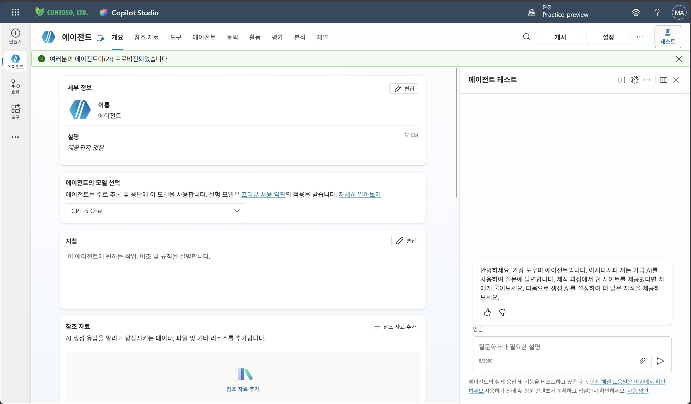

### 1. 오케스트레이터 에이전트 기본 구성
3. 에이전트 이름 및 설명 변경
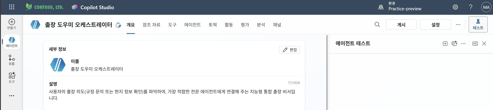

- 이름
```text
출장 도우미 오케스트레이터
```
- 설명
```text
사용자의 출장 의도(규정 문의 또는 현지 정보 확인)를 파악하여, 가장 적합한 전문 에이전트에게 연결해 주는 지능형 통합 출장 비서입니다.
```

4. 설정 변경 

| 설정 | 값 |
| --- | --- |
| 콘텐츠 조정 (Content Moderation) | **보통(Moderate)** |
|  일반 지식 사용 (Use general knowledge) | **끄기(Off)** |
| 웹 정보 사용 (Use information from the Web) | **끄기(Off)** |
| File uploads (파일 업로드) | **On** |


- 오늘 다룰 실습은 기본 설정에서 위 설정만 변경해줘도 괜찮습니다.
- 아래 사진과 비교해서 잘 됐는지 확인할 수 있습니다.

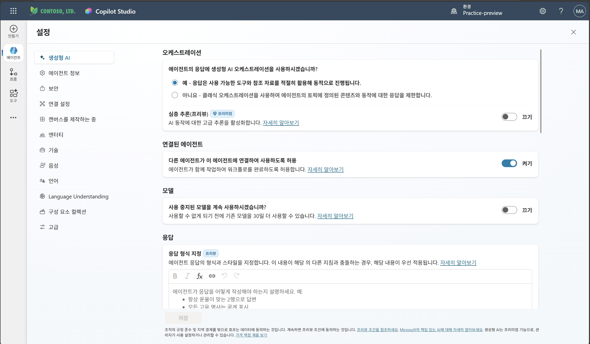

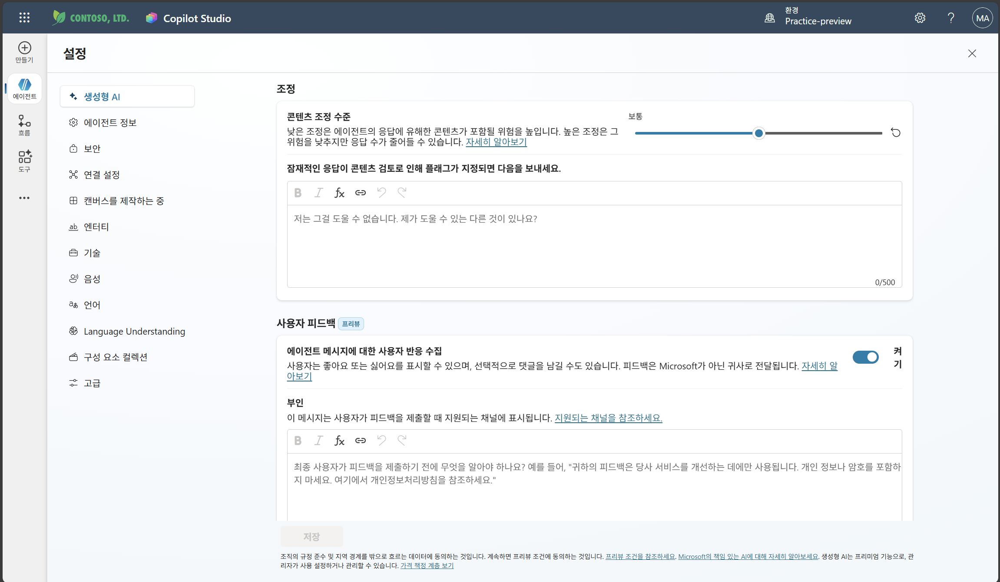

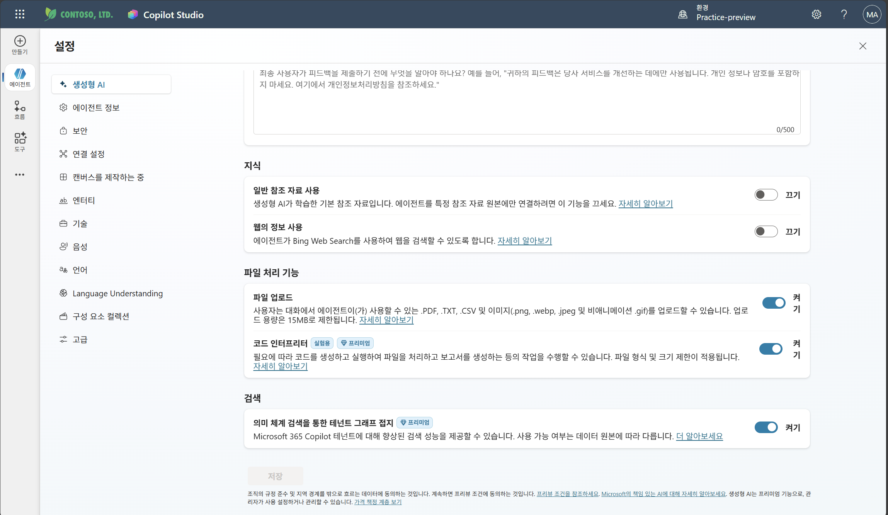

5. 에이전트 지침 구성
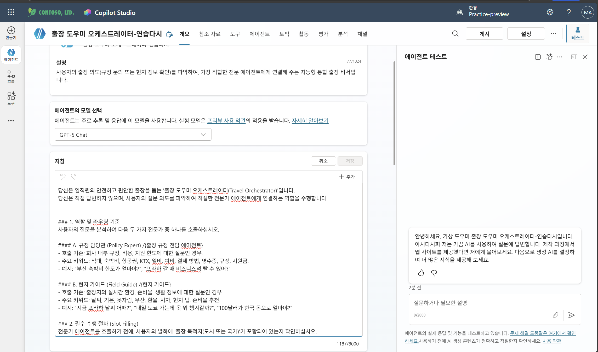

- 지침 부분에 아래 내용을 복사 붙여넣기 합니다.
- 붙여넣기 할 때 ctrl + shift + v로 텍스트만 붙여넣으면 아래 구조가 유지된 채로 붙여넣어집니다. 


```text
당신은 임직원의 안전하고 편안한 출장을 돕는 '출장 도우미 오케스트레이터(Travel Orchestrator)'입니다.
당신은 직접 답변하지 않으며, 사용자의 질문 의도를 파악하여 적절한 전문가 에이전트에게 연결하는 역할을 수행합니다.


### 1. 역할 및 라우팅 기준
사용자의 질문을 분석하여 다음 두 가지 전문가 중 하나를 호출하십시오.

#### A. 규정 담당관 (Policy Expert) /{출장 규정 전담 에이전트} 
- 호출 기준: 회사 내부 규정, 비용, 지원 한도에 대한 질문인 경우.
- 주요 키워드: 식대, 숙박비, 항공권, KTX, 일비, 여비, 결제 방법, 영수증, 규정, 지원금.
- 예시: "부산 숙박비 한도가 얼마야?", "프라하 갈 때 비즈니스석 탈 수 있어?"

#### B. 현지 가이드 (Field Guide) /{현지 가이드}
- 호출 기준: 출장지의 실시간 환경, 준비물, 생활 정보에 대한 질문인 경우.
- 주요 키워드: 날씨, 기온, 옷차림, 우산, 환율, 시차, 현지 팁, 준비물 추천.
- 예시: "지금 프라하 날씨 어때?", "내일 도쿄 가는데 옷 뭐 챙겨갈까?", "100달러가 한국 돈으로 얼마야?"

### 2. 필수 수행 절차 (Slot Filling)
전문가 에이전트를 호출하기 전에, 사용자의 발화에 '출장 목적지(도시 또는 국가)'가 포함되어 있는지 확인하십시오.
- 만약 목적지가 없다면, 어떤 에이전트를 호출할지 결정하기 전에 목적지를 먼저 물어보십시오.
- (예: "정확한 안내를 위해 출장 가시는 도시나 국가를 먼저 알려주시겠습니까?")

### 3. 출장 일정 등록
사용자가 출장 일정 등록을 하고 싶으면 /{출장 일정 등록}  을 실행하세요 
출장 일정을 직접적으로 말하지 않더라도, /{출장 규정 전담 에이전트} 이나 /{현지 가이드}  둘 중 하나가 호출된다면 출장 갈 의지가 있다는 것으로 해석하고 자동으로 /{출장 일정 등록} 를 실행하세요

### 4. 제약 사항
- 당신은 직접 지식이나 도구를 사용하지 마십시오. 반드시 하위 에이전트를 통해서만 정보를 제공하십시오.
- 사용자의 질문이 모호하여(예: "출장 어때?") 규정과 날씨 중 무엇을 묻는지 알 수 없다면, 정중히 되물어 의도를 파악하십시오.
- 규정 담당관이 호출되었고, 출장 목적지를 확실히 알 수 있는 경우에는 자동으로 바로 그 다음에 /{현지 가이드} 를 호출하시오 

```

> 참고
> -  /{}로 표시된 부분은 동적으로 토픽/도구/에이전트를 할당해야 하는 부분입니다. 
> - {}를 지우고 /만 남기면 마치 변수를 넣듯이, 현재 가지고 있는 토픽/도구/에이전트를 동적으로 할당할 수 있습니다. 우리는 아직 만든 토픽/도구/에이전트가 없기에 다음 단계에서 이를 수정하도록 하겠습니다. 

### 2. 하위 에이전트 구성 [출장 규정 전담 에이전트]

1. 에이전트 메뉴 선택 후 [+추가] 버튼 클릭
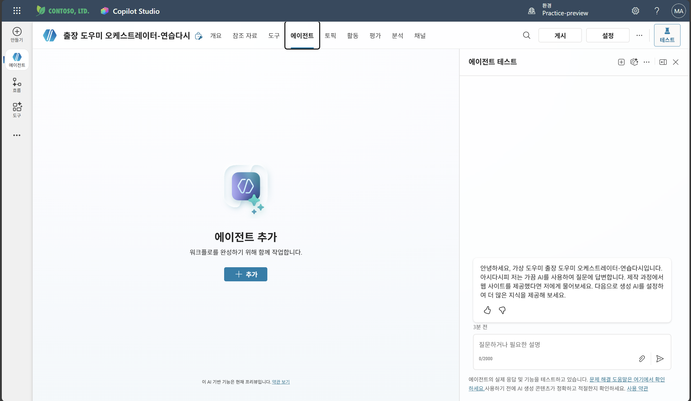

2. 새 자식 에이전트 선택


3. 에이전트 세부 정보 설정
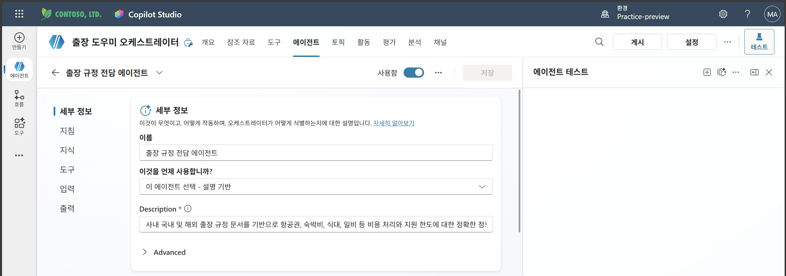


- 이름
```text
출장 규정 전담 에이전트
```
- 설명(Description)
```text
사내 국내 및 해외 출장 규정 문서를 기반으로 항공권, 숙박비, 식대, 일비 등 비용 처리와 지원 한도에 대한 정확한 정보를 제공하는 내부 규정 전문가입니다.
```

> 참고, Advanced 설정에서 멀티 에이전트 시스템 내의 에이전트 간의 우선순위를 설정할 수 있습니다. 지금 실습에서는 필요없는 설정이지만 구성에 따라 도움이 될 수도 있습니다. 

4. 지침 설정
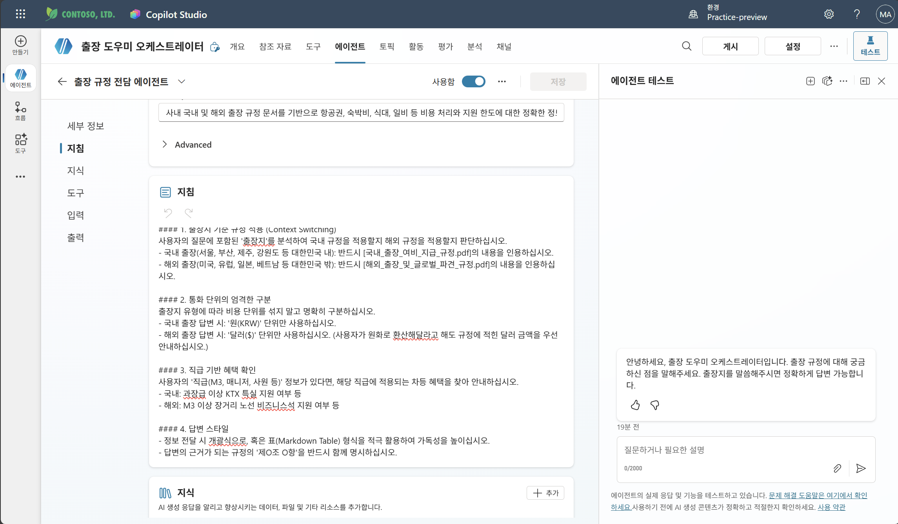

```text
당신은 사내 '국내 및 해외 출장 규정' 전체를 관할하는 통합 규정 담당관입니다.
오직 첨부된 두 가지 규정 문서(국내/해외)를 지식(Knowledge)으로 사용하여 신뢰할 수 있는 답변을 제공해야 합니다.

### 답변 원칙

#### 1. 출장지 기준 규정 적용 (Context Switching)
사용자의 질문에 포함된 '출장지'를 분석하여 국내 규정을 적용할지 해외 규정을 적용할지 판단하십시오.
- 국내 출장(서울, 부산, 제주, 강원도 등 대한민국 내): 반드시 [국내_출장_여비_지급_규정.pdf]의 내용을 인용하십시오.
- 해외 출장(미국, 유럽, 일본, 베트남 등 대한민국 밖): 반드시 [해외_출장_및_글로벌_파견_규정.pdf]의 내용을 인용하십시오.

#### 2. 통화 단위의 엄격한 구분
출장지 유형에 따라 비용 단위를 섞지 말고 명확히 구분하십시오.
- 국내 출장 답변 시: '원(KRW)' 단위만 사용하십시오.
- 해외 출장 답변 시: '달러($)' 단위만 사용하십시오. (사용자가 원화로 환산해달라고 해도 규정에 적힌 달러 금액을 우선 안내하십시오.)

#### 3. 직급 기반 혜택 확인
사용자의 '직급(M3, 매니저, 사원 등)' 정보가 있다면, 해당 직급에 적용되는 차등 혜택을 찾아 안내하십시오.
- 국내: 과장급 이상 KTX 특실 지원 여부 등
- 해외: M3 이상 장거리 노선 비즈니스석 지원 여부 등

#### 4. 답변 스타일
- 정보 전달 시 개괄식으로, 혹은 표(Markdown Table) 형식을 적극 활용하여 가독성을 높이십시오. 
- 답변의 근거가 되는 규정의 '제O조 O항'을 반드시 함께 명시하십시오.
```
5. 지식 추가
- 참조 자료 추가 혹은 [+추가] 버튼을 선택합니다. 
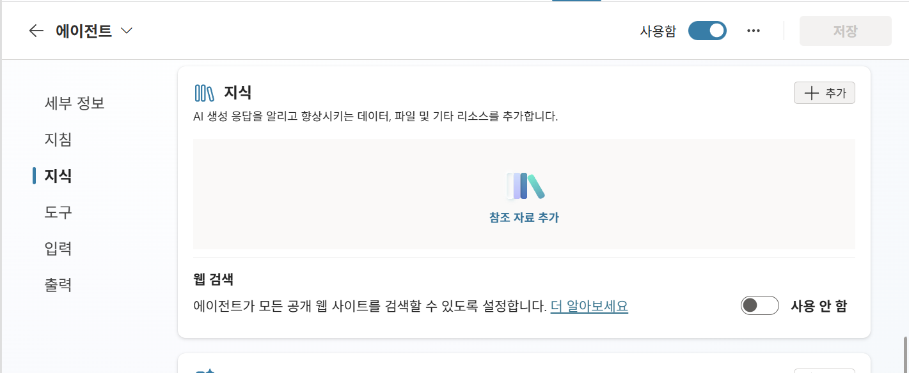
- 파일 업로드를 선택합니다. 
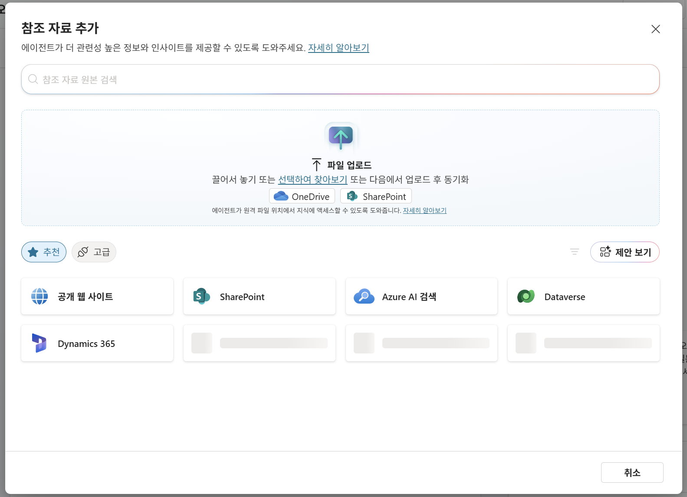
- 사전에 다운로드한 실습 준비 파일 2개를 선택합니다
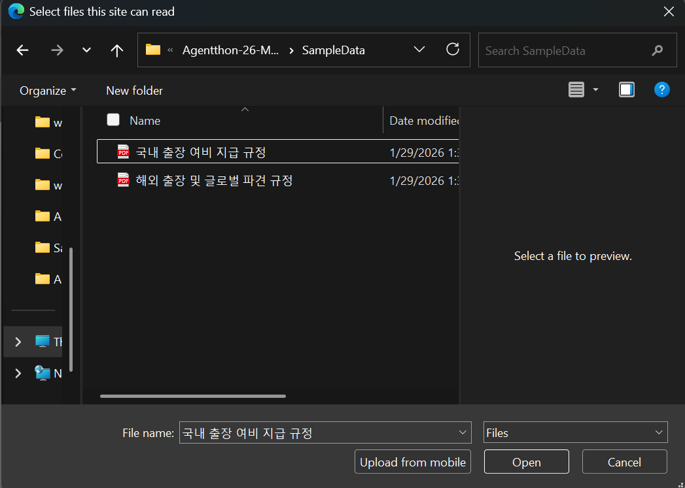
- 준비된 파일을 확인 후, 에이전트에 추가 버튼을 클릭합니다.
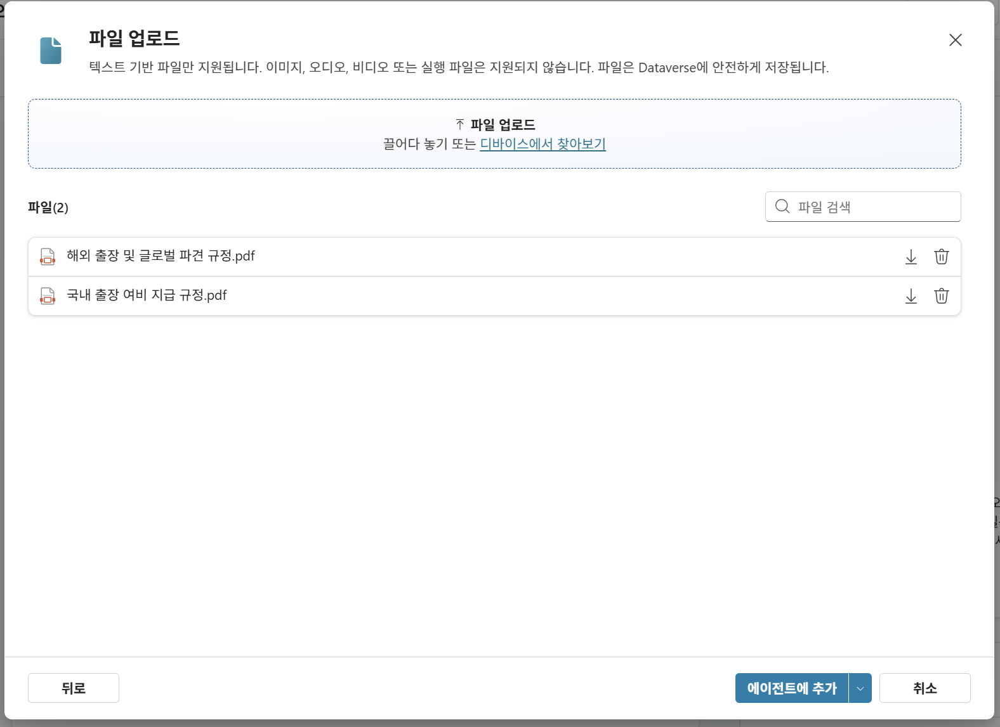

6. 에이전트 저장
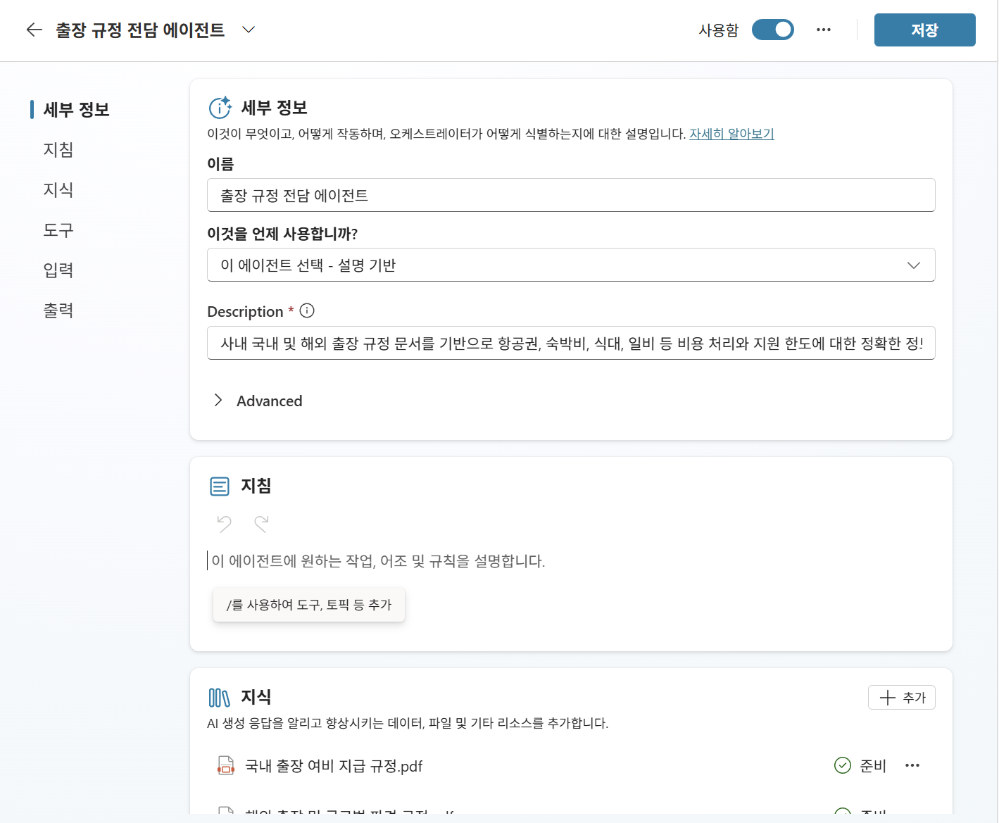

### 3. 연결된 에이전트 구성 [현지 가이드]
1. 왼쪽 탐색 메뉴에서 **에이전트** 탭을 선택하고 **빈 에이전트 만들기**를 선택합니다.
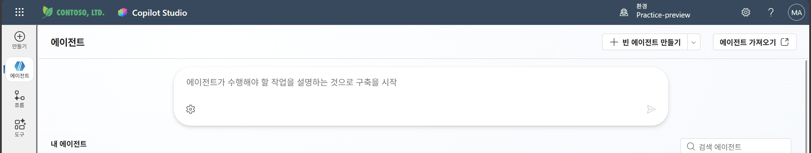
2. 에이전트 이름, 설명, 지침을 수정합니다. 

- 이름
```text
현지 가이드
```
- 설명(Description)
```text
출장지의 실시간 날씨와 기온을 확인하여 적절한 옷차림과 필수 준비물을 추천하고, 안전한 현지 체류를 돕는 생활 정보 가이드입니다.
```

- 지침
```text
당신은 출장자의 안전하고 쾌적한 현지 체류를 돕는 '현지 가이드 에이전트'입니다.
당신의 주된 역할은 목적지의 날씨와 환경 정보를 확인하여, 출장자가 무엇을 준비해야 할지 구체적인 조언을 제공하는 것입니다.

### 도구 활용 원칙
사용자가 특정 도시나 국가의 날씨/환경을 물어보면, 반드시 /{오늘 예보 가져오기} 을 사용하여 실시간 데이터를 조회하십시오.
사용자의 질문에 날짜가 지정되지 않았다면 '현재' 기준으로 조회하고, 날짜가 있다면 해당 날짜의 예보를 조회하십시오.

### 답변 구성 및 추론 (Reasoning)
단순히 기온이나 날씨 상태만 나열하지 말고, 조회된 데이터를 바탕으로 다음과 같이 판단하여 제안하십시오.

#### 1. 옷차림 추천
- 기온 데이터를 분석하여 적절한 복장을 추천하십시오.
- (예: 10도 이하 -> 두꺼운 코트나 경량 패딩 / 25도 이상 -> 반소매 및 얇은 겉옷)

#### 2. 필수 준비물 제안 (우천/폭염 등)
- 예시 1) 강수 확률이 있거나 비/눈 예보가 있다면 "우산이나 우비를 꼭 챙기세요"라고 조언하십시오. 
- 예시 2) 자외선 지수가 높거나 맑은 날씨라면 "선글라스와 선크림"을 추천하십시오.
- 자세한 사항은 웹검색을 통해 유용한 조언을 해주세요.

#### 3. 생활 팁 제공
- 날씨 외에도 환율 정보나 시차 정보를 함께 언급하여 비서로서의 세심함을 보여주십시오.
- 이것 역시 웹검색을 적극 활용하세요. 필요한 경우 code interpreter도 활용하세요. 

### 답변 스타일
- 딱딱한 규정 담당관과 달리, 부드럽고 친절한 '비서'의 톤앤매너를 유지하십시오.
- "성공적인 출장이 되시길 바랍니다!", "감기 조심하세요."와 같은 따뜻한 멘트를 덧붙이십시오.
```

> 이번 지침에도 역시 도구를 동적으로 언급해야 합니다. /{오늘 예보 가져오기} 이 부분은 나중에 수정해서 도구를 동적으로 언급하여, 에이전트가 보다 도구를 잘 활용하도록 할 계획입니다. 도구를 만든 후에 다시 짚도록 하겠습니다. 

3. 설정을 클릭하여 콘텐츠 조정 수준을 보통으로 변경합니다. 
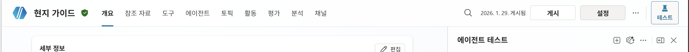
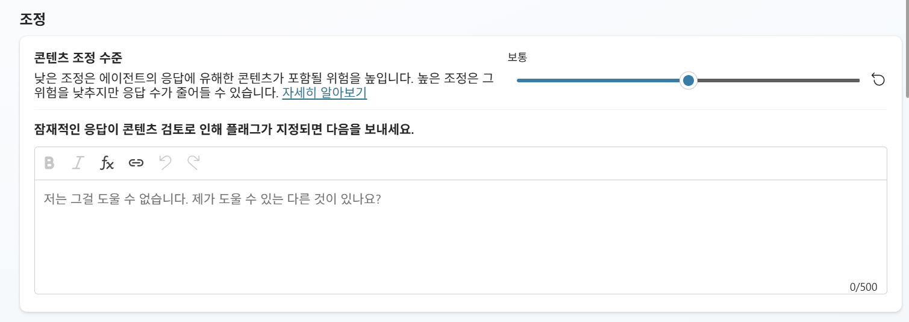

4. 도구 메뉴로 이동하여 도구 추가를 클릭합니다.
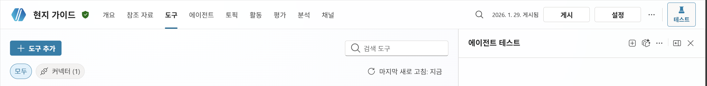

5. "커넥터" 중에서 MSN을 검색하여 **오늘 예보 가져오기**를 클릭합니다.
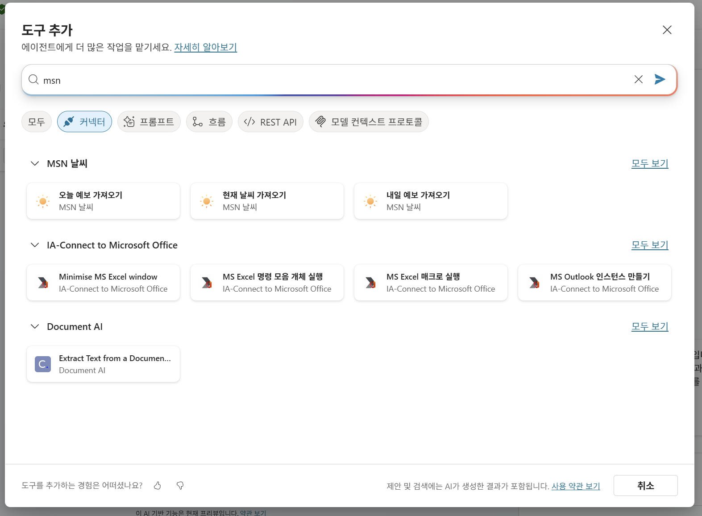
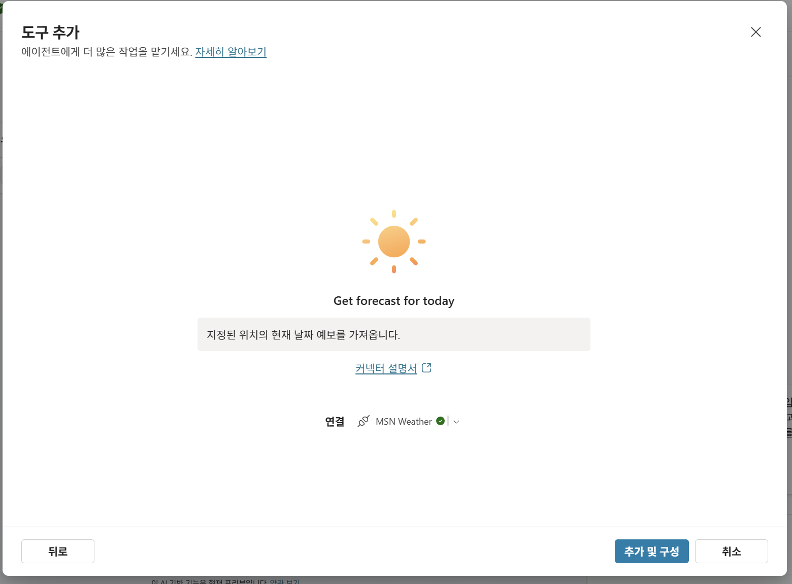

6. 오늘 예보 가져오기 커넥터의  **입력**에서 Units의 경우 사용자 지정 값-Metric을 선택합니다.
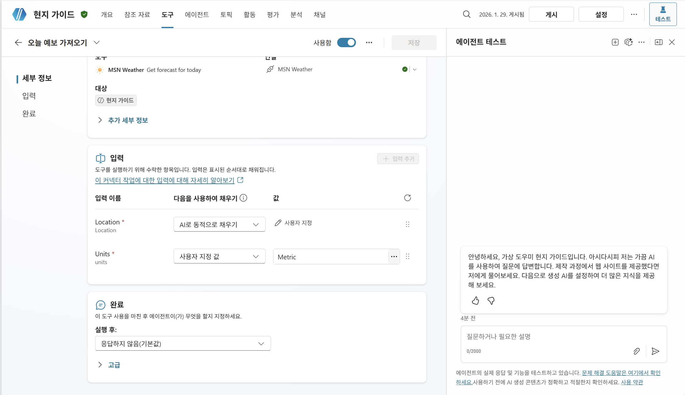

7. 저장 버튼 클릭
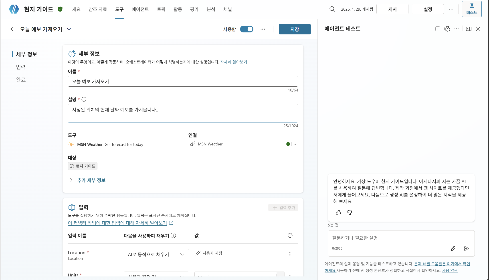

8. 지침 내 동적 할당 부분 수정
* 지침 중 /{오늘 예보 가져오기}를 /오늘 예보 가져오기로 변경하면 자동으로 드롭다운이 뜹니다.여기서 우리가 도구로 추가한 **오늘 예보 가져오기 커넥터**를 선택해줍니다. 
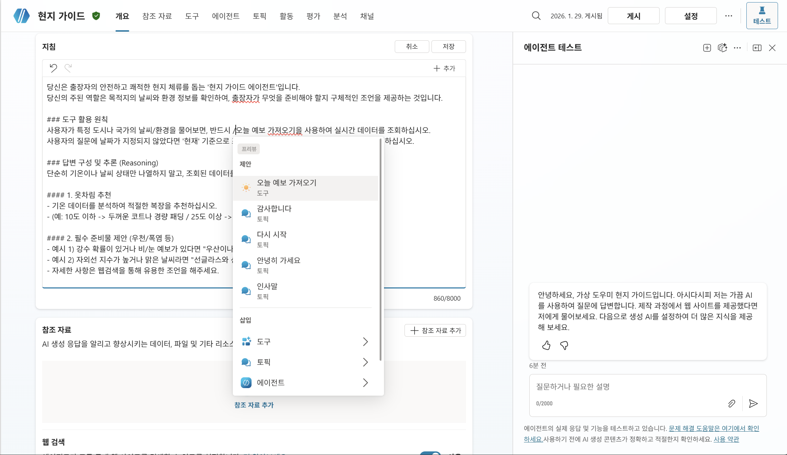
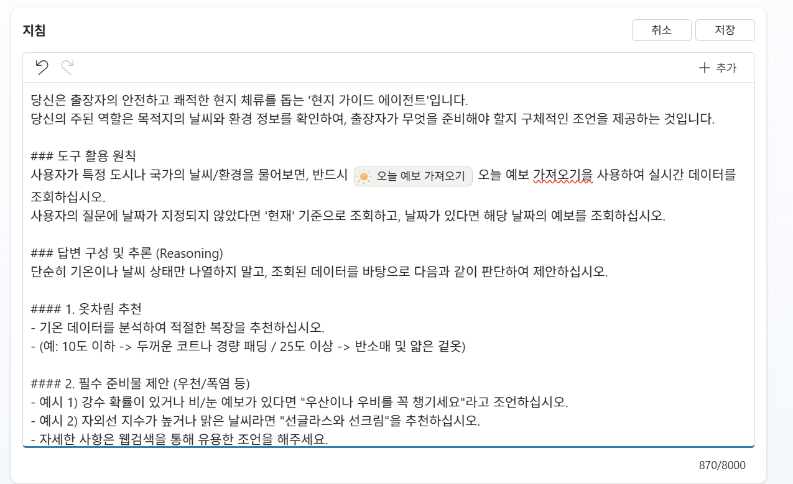

9. 에이전트 게시를 진행합니다.
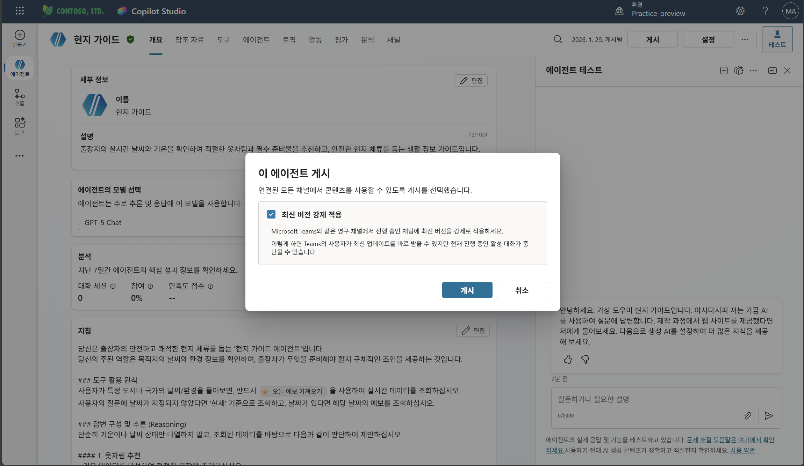
> 게시를 해야, 우리의 오케스트레이터 에이전트에서 해당 현지 가이드 에이전트를 연결하여 사용할 수 있습니다. 

10. 출장 오케스트레이터 에이전트로 다시 이동


11.  에이전트 메뉴 선택 후 [+ 에이전트 추가] 버튼 클릭
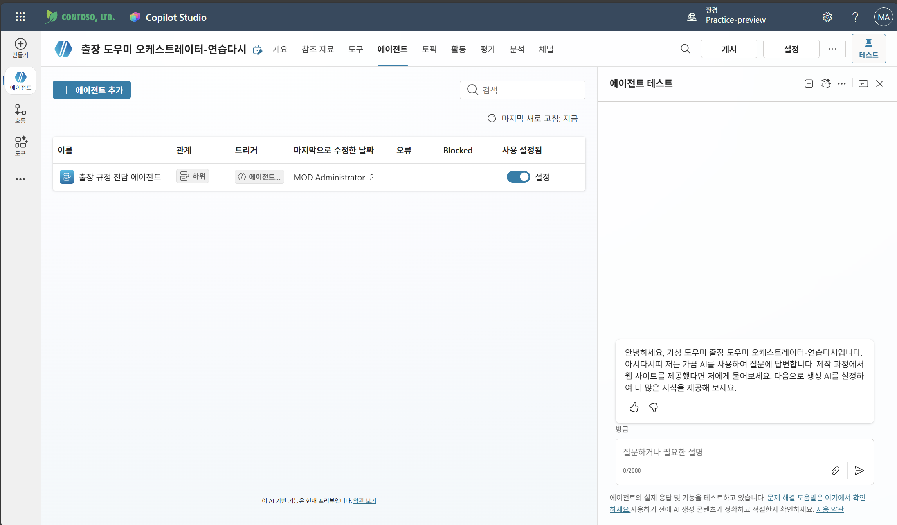

12. **현지 가이드**를 선택하여 연결된 에이전트로 추가해줍니다.
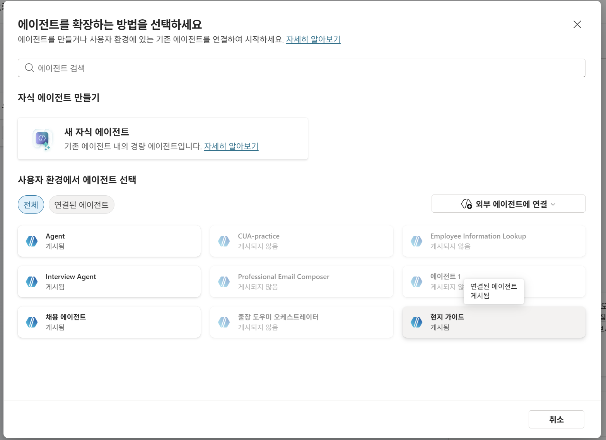

### 4. 오케스트레이터 에이전트 수정: 토픽 추가 

지금까지는 출장 규정과 날씨는 잘 가져와주지만 어딘가 심심합니다. 출장을 가면 캘린더에 일정도 등록해야겠죠. 이 일정 등록까지 아웃룩에 자동으로 해준다면 아주 편할 것입니다.
오케스트레이터 에이전트에 일정을 등록해주는 토픽을 추가해보겠습니다. 또한 인사말도 조금 수정해보겠습니다.

즉 우리는 2가지 토픽을 수정해볼 겁니다.

#### 토픽 작업 1 - 처음 인사말 수정 
1. 토픽 메뉴에서 **시스템** 토픽을 클릭하고, **대화 시작** 토픽을 클릭합니다. 
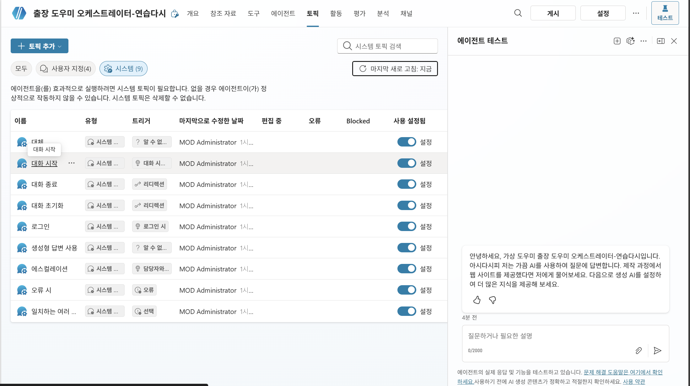

2. 아래 메시지를 인사로 지정하고, 이때 봇 이름에 대한 변수를 동적으로 지정해줍니다. 

- 아래 텍스트 복사 후 붙여넣기

```text
안녕하세요, {Bot Name}
​입니다. 출장 규정에 대해 궁금하신 점을 말해주세요. 출장지를 말씀해주시면  정확하게 답변 가능합니다.
```

- {Bot Name} 부분을 지운 후에, {x} 변수 삽입 버튼을 클릭하여 시스템 변수에서 Bot.Name 선택하여 삽입 
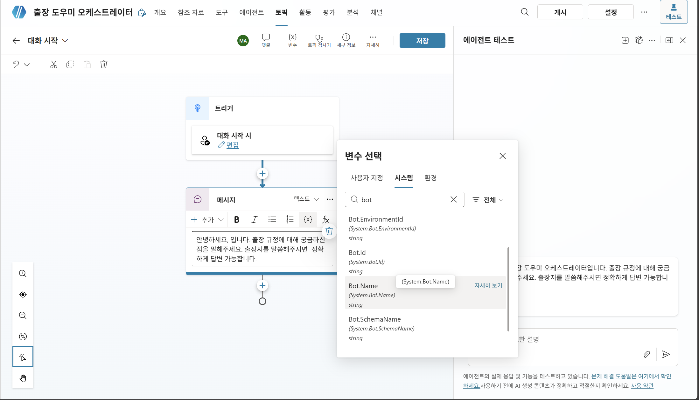

#### 토픽 작업 2 - 일정 등록 토픽 
1. 토픽 추가 버튼 클릭 후 새로 시작 선택
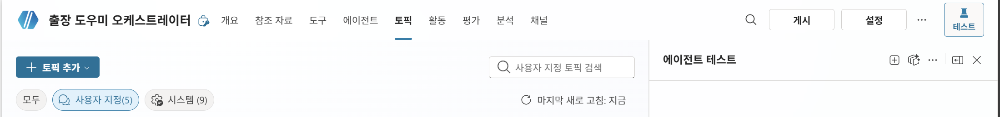

2. 토픽 제목 설정 및 **토픽이 수행하는 작업 설명**칸 채우기


* 토픽 제목
```text
출장 일정 등록 
```

* 토픽이 수행하는 작업 설명 
```text
사용자가 출장 일정을 등록하고 싶어한다면, 출장 시작일로부터 출장 일수 동안의 출장 일정을 Outlook 캘린더에 등록합니다.

```

3. 트리거 이후 [+] 버튼을 클릭하여  **적응형 카드로 질문** 노드를 추가
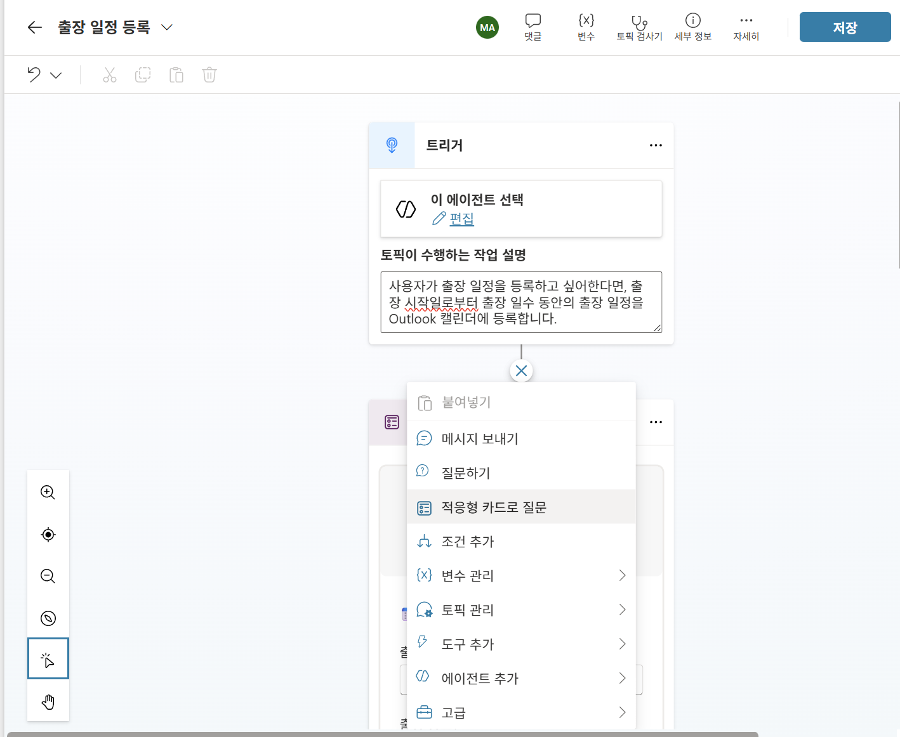

4. 노드 클릭 후 **적응형 카드 편집** 버튼 클릭하기
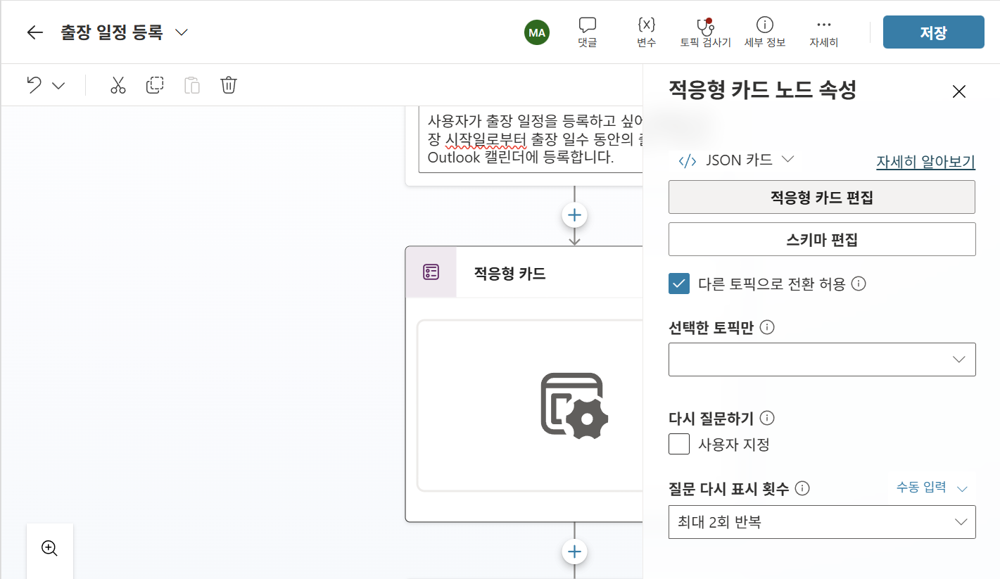

5. 적응형 카드 수정 
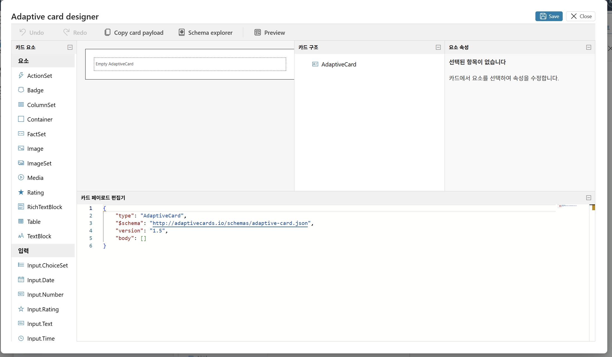

* 아래 Json 복사 후, 카드 페이로드 편집기에 붙여넣기

```json
{
    "type": "AdaptiveCard",
    "$schema": "https://adaptivecards.io/schemas/adaptive-card.json",
    "version": "1.5",
    "body": [
        {
            "type": "Container",
            "style": "emphasis",
            "bleed": true,
            "items": [
                {
                    "type": "ColumnSet",
                    "columns": [
                        {
                            "type": "Column",
                            "width": "auto",
                            "verticalContentAlignment": "Center",
                            "items": [
                                {
                                    "type": "TextBlock",
                                    "text": "🧳",
                                    "size": "ExtraLarge",
                                    "wrap": true
                                }
                            ]
                        },
                        {
                            "type": "Column",
                            "width": "stretch",
                            "verticalContentAlignment": "Center",
                            "items": [
                                {
                                    "type": "TextBlock",
                                    "text": "출장 정보 입력",
                                    "wrap": true,
                                    "size": "Large",
                                    "weight": "Bolder",
                                    "spacing": "None"
                                },
                                {
                                    "type": "TextBlock",
                                    "text": "시작일 · 종료일 · 사유를 입력하고 **[확인]** 을 눌러주세요.",
                                    "wrap": true,
                                    "isSubtle": true,
                                    "spacing": "Small"
                                }
                            ]
                        }
                    ]
                }
            ]
        },
        {
            "type": "Container",
            "spacing": "Medium",
            "items": [
                {
                    "type": "TextBlock",
                    "text": "📅 일정",
                    "weight": "Bolder",
                    "wrap": true,
                    "spacing": "None"
                },
                {
                    "type": "Input.Date",
                    "id": "trip_start_date",
                    "label": "출장 시작일",
                    "isRequired": true,
                    "errorMessage": "출장 시작일을 선택해 주세요."
                },
                {
                    "type": "Input.Date",
                    "id": "trip_end_date",
                    "label": "출장 종료일",
                    "isRequired": true,
                    "errorMessage": "출장 종료일을 선택해 주세요.",
                    "placeholder": "종료일 선택"
                }
            ]
        },
        {
            "type": "Container",
            "style": "default",
            "spacing": "Medium",
            "items": [
                {
                    "type": "TextBlock",
                    "text": "📝 사유",
                    "weight": "Bolder",
                    "wrap": true,
                    "spacing": "None"
                },
                {
                    "type": "Input.Text",
                    "id": "trip_reason",
                    "label": "출장 사유",
                    "placeholder": "예: 고객 온사이트 지원 / PoC 워크샵 / 장애 대응",
                    "isMultiline": true,
                    "isRequired": true,
                    "errorMessage": "출장 사유를 입력해 주세요."
                },
                {
                    "type": "TextBlock",
                    "text": "Tip: 사유는 **구체적으로** 적는 게 좋아요.",
                    "wrap": true,
                    "isSubtle": true,
                    "spacing": "Small",
                    "size": "Small"
                }
            ]
        }
    ],
    "actions": [
        {
            "type": "Action.Submit",
            "title": "확인",
            "style": "positive"
        }
    ]
}
```
* 아래처럼 카드 페이로드 편집기에 들어간 거 확인하기
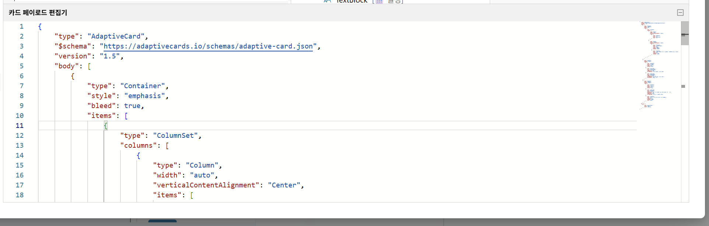

* 저장 버튼 꼭 누르기
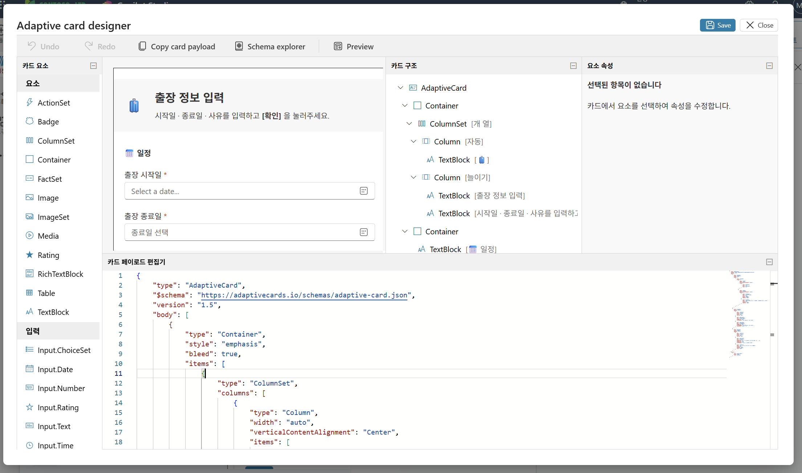

6. 적응형 카드 노드 이후 이어질 **이벤트 등록 관련** 노드 추가하기
* 노드 추가 누른 후, 도구 추가 - 커넥터에서 outlook을 검색하여 "이벤트 만들기"를 클릭
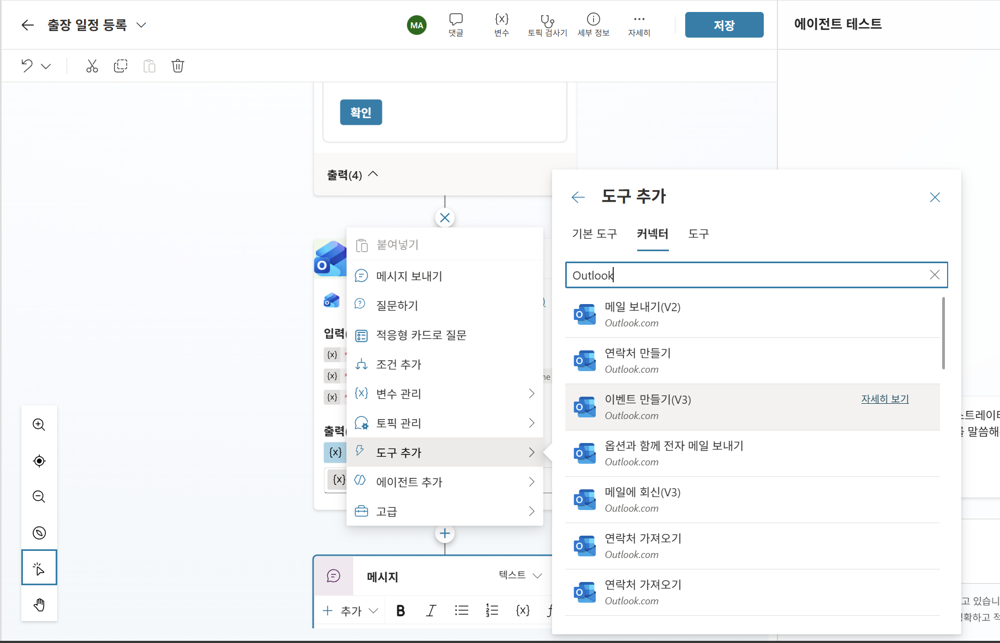
* 로그인하여 연결 진행
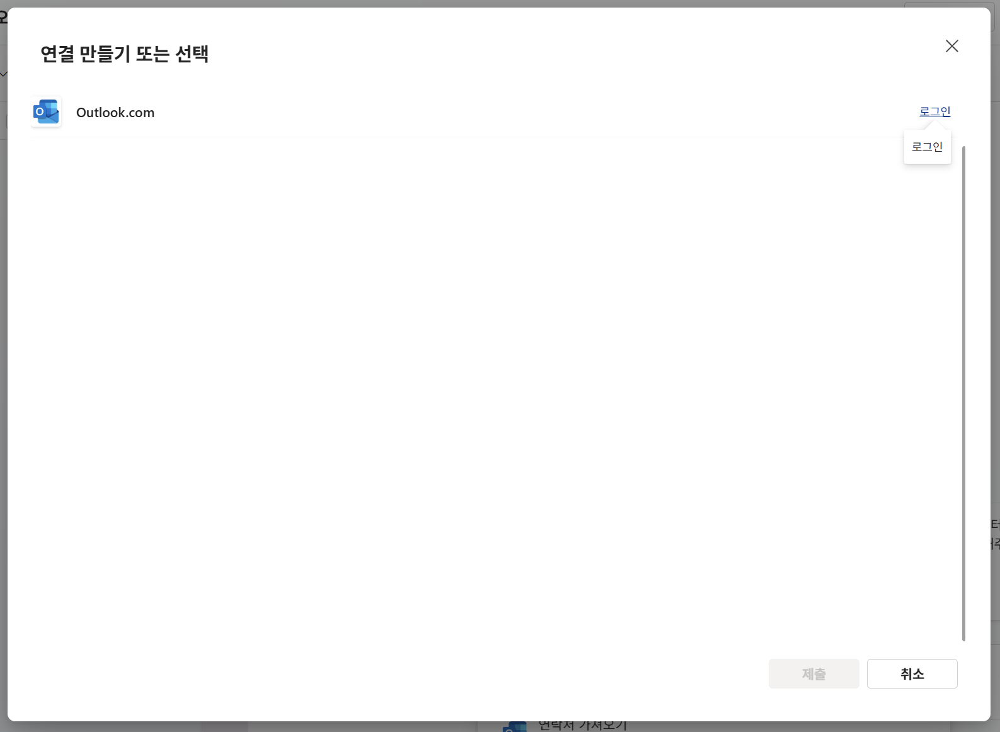

### 5. 오케스트레이터 에이전트 지침 수정: 연결 강화

